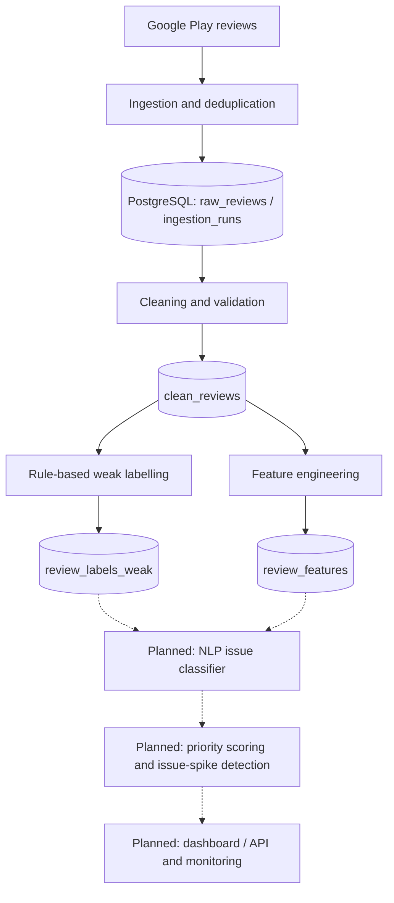

# Digital Wallet Review Intelligence Platform

> **Status:** Work in progress — the data ingestion, cleaning, weak-labelling, and feature-engineering stages are implemented. Machine learning, alerting, and user-facing services are planned, not yet operational.

## Overview

Public app reviews can provide early signals of problems affecting digital wallet users, such as failed payments, account access issues, refund delays, and suspected fraud. However, these reviews are unstructured and difficult to analyse consistently across applications.

This project is developing a **digital wallet product-intelligence pipeline** that collects Google Play reviews, stores and validates them in PostgreSQL, prepares text for analysis, and assigns preliminary issue labels using configurable rules. Its longer-term goal is to classify wallet-specific complaints with NLP, prioritise urgent cases, detect emerging issue spikes, and present app-level and cross-app trends to product and support teams.

The project is designed as an **incremental monitoring system**, not a complete historical archive of Google Play reviews.

## Current implementation

| Component | Status | Details |
| --- | --- | --- |
| Google Play ingestion | Implemented (sample runner) | Collects recent reviews for enabled apps in `config/apps.yaml`; currently requests 10 per app by default. |
| PostgreSQL storage and ingestion audit | Implemented | Stores app metadata, raw reviews, and ingestion-run records. |
| Review cleaning | Implemented | Lowercasing, whitespace normalisation, text lengths, word counts, and empty-text flagging. |
| Weak labelling | Implemented | YAML-configured scope/issue rules, priority ordering, match scoring, and database upsert. Labels are heuristic, not ground truth. |
| Manual gold-label workflow | Implemented tooling; end-to-end verification pending | Labelling guidance and CSV export/import scripts exist. The previously reported SQL typo has been corrected; the full workflow still needs validation. |
| Feature engineering | Implemented | Review metadata and nine keyword-indicator features, excluding label and prediction columns. |
| Validation | Implemented as scripts | Database/data-quality checks for ingestion, cleaning, weak labels, manual labels, and review features; no unit-test suite yet. |
| NLP classifier, priority scoring, spike alerts, dashboard/API | Planned | Not yet implemented. |

## Architecture

The current pipeline and intended next stages are shown below. Dashed nodes indicate **planned** components.



A separate manual-label export/import workflow is available for building reliable human-reviewed evaluation data; its end-to-end operation still needs validation. **Manual labels are intended for evaluation and feedback; the eventual review-classification pipeline is intended to make routine predictions automatically.**

## Technology stack

**Currently used:** Python, PostgreSQL 16, Docker Compose (local database), SQL, SQLAlchemy, psycopg2-binary, pandas, PyYAML, `google-play-scraper`, and regular expressions.

**Planned (not yet installed/implemented as project components):** scikit-learn-based NLP modelling, experiment tracking, API/dashboard serving, automated tests/CI, and drift monitoring. Tool choices will be confirmed as development progresses.

## Repository structure

```text
config/          App settings, issue taxonomy, weak-label rules, feature safety
data_ingestion/ Google Play source abstraction and sample runner
 database/       PostgreSQL schema, app seed data, derived-table SQL
 docs/           Manual labelling guide
 src/
   cleaning/     Text cleaning and clean_reviews builder
   database/     Database connections and persistence
   features/     Review feature builder
   labelling/    Weak labels and manual-label CSV tools
   validation/   Database and data-quality validation scripts
 README.md
 docker-compose.yml
 requirements.txt
```

## Getting started (local development)

The commands below are for **PowerShell on Windows**, run from the repository root. Python, Docker, and Docker Compose are required. Docker Compose starts PostgreSQL, but **does not automatically create the project tables**.

### 1. Set up Python and PostgreSQL

```powershell
python -m venv .venv
.\.venv\Scripts\Activate.ps1
python -m pip install -r requirements.txt

docker compose up -d
```

The database connector also supports a `DATABASE_URL` environment-variable override. The checked-in database/Compose settings currently contain local development defaults; review and externalise them before any public deployment. Do not commit real credentials or `.env` files.

### 2. Initialise the implemented database tables

Run these scripts **in order**. These commands use the configured PostgreSQL container environment variables rather than printing their values:

```powershell
Get-Content database\schema.sql | docker compose exec -T postgres sh -c 'psql -U "$POSTGRES_USER" -d "$POSTGRES_DB"'
Get-Content database\seed_apps.sql | docker compose exec -T postgres sh -c 'psql -U "$POSTGRES_USER" -d "$POSTGRES_DB"'
Get-Content database\clean_reviews.sql | docker compose exec -T postgres sh -c 'psql -U "$POSTGRES_USER" -d "$POSTGRES_DB"'
Get-Content database\review_labels_weak.sql | docker compose exec -T postgres sh -c 'psql -U "$POSTGRES_USER" -d "$POSTGRES_DB"'
Get-Content database\review_labels_manual.sql | docker compose exec -T postgres sh -c 'psql -U "$POSTGRES_USER" -d "$POSTGRES_DB"'
Get-Content database\review_features.sql | docker compose exec -T postgres sh -c 'psql -U "$POSTGRES_USER" -d "$POSTGRES_DB"'
```

The previously reported foreign-key typo in `database/review_labels_manual.sql` has been corrected. Confirm schema creation and the manual-label export/import workflow locally before relying on it.

### 3. Run the available pipeline

```powershell
python -m data_ingestion.fetch_sample_reviews
python -m src.cleaning.build_clean_reviews
python -m src.labelling.weak_label_reviews
python -m src.features.build_review_features
```

The ingestion runner currently retrieves 10 recent reviews per enabled app; it does not yet offer a runtime argument for collection size. Configure target apps in `config/apps.yaml`.

### 4. Run data-validation checks

```powershell
python -m src.validation.check_ingestion_database
python -m src.validation.check_clean_reviews
python -m src.validation.check_weak_labels
python -m src.validation.check_manual_labels
python -m src.validation.check_review_features
```

The feature-validation script has now been reported as committed. The manual-label check should be run after creating its table and importing labelled records. These are executable validation scripts, **not** a `pytest` unit-test suite.

## Limitations and next steps

- **Small sample ingestion:** the current runner defaults to 10 recent reviews per enabled app; it is not yet a scheduled, continuous collector.
- **Source settings:** English/Malaysia are currently hard-coded in the Google Play source rather than fully driven by each app's configuration.
- **Heuristic labels:** current weak labels use substring keyword matches, and unmatched scope defaults to `wallet_related`; weak labels should not be treated as validated ground truth.
- **Manual labels:** the previously reported SQL typo has been corrected; the CSV export/import workflow and manual-label validation still need end-to-end verification.
- **Local setup:** database tables must be applied manually; there is no automated migration/init mechanism. Dependencies are not pinned to a lockfile.
- **No production ML system yet:** model training/evaluation, priority scoring, issue-spike detection, serving, dashboarding, CI, and drift monitoring remain future work.

The next major development phase is the NLP issue-classification baseline, with credible evaluation against manually checked labels. Later phases will introduce prioritisation, spike detection, model serving, visualisation, and monitoring.

---

*Development is ongoing. The status table describes implemented functionality; the architecture also shows the intended future direction.*
