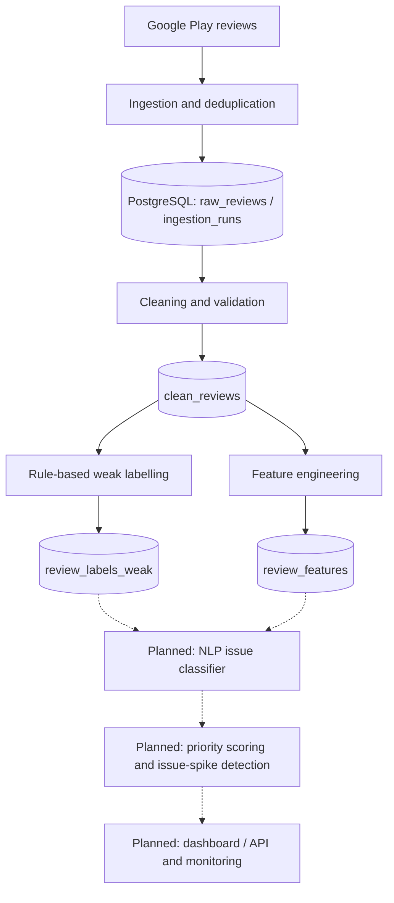

# Digital Wallet Review Intelligence Platform

> **Status:** Work in progress — the data ingestion, cleaning, weak-labelling, and feature-engineering stages are implemented. Machine learning, alerting, and user-facing services are planned, not yet operational.

## Overview

Public app reviews can provide early signals of problems affecting digital wallet users, such as failed payments, account access issues, refund delays, and suspected fraud. However, these reviews are unstructured and difficult to analyse consistently across applications.

This project is developing a **digital wallet product-intelligence pipeline** that collects Google Play reviews, stores and validates them in PostgreSQL, prepares text for analysis, and assigns preliminary issue labels using configurable rules. Its longer-term goal is to classify wallet-specific complaints with NLP, prioritise urgent cases, detect emerging issue spikes, and present app-level and cross-app trends to product and support teams.

The project is designed as an **incremental monitoring system**, not a complete historical archive of Google Play reviews.

## Current implementation

| Component | Status | Details |
| --- | --- | --- |
| Google Play ingestion | Implemented (sample runner) | Collects recent reviews for enabled apps in `config/apps.yaml`; currently requests 10 per app by default. |
| PostgreSQL storage and ingestion audit | Implemented | Stores app metadata, raw reviews, and ingestion-run records. |
| Review cleaning | Implemented | Lowercasing, whitespace normalisation, text lengths, word counts, and empty-text flagging. |
| Weak labelling | Implemented | YAML-configured scope/issue rules, priority ordering, match scoring, and database upsert. Labels are heuristic, not ground truth. |
| Manual gold-label workflow | Implemented tooling | Labelling guidance, CSV export/import, and database validation are available. Human-reviewed evaluation data still needs to be created. |
| Feature engineering | Implemented | Review metadata and nine keyword-indicator features, excluding label and prediction columns. |
| Validation | Implemented as scripts | Database/data-quality checks for ingestion, cleaning, weak labels, manual labels, and review features; no unit-test suite yet. |
| NLP classifier, priority scoring, spike alerts, dashboard/API | Planned | Not yet implemented. |

## Architecture

The current pipeline and intended next stages are shown below. Dashed nodes indicate **planned** components.



A separate manual-label export/import workflow is available for building human-reviewed evaluation data; see the optional workflow below. **Manual labels are intended for evaluation and feedback; the eventual review-classification pipeline is intended to make routine predictions automatically.**

## Planned machine learning approach

The planned NLP classifier will predict each review's primary issue category from the existing taxonomy, such as payment failures, refund disputes, or login problems. Weak labels will bootstrap training, while a separate, held-out set of manually reviewed gold labels will support credible evaluation. The first baselines will use **TF-IDF + Logistic Regression** and **TF-IDF + Linear SVM**.

Evaluation will report macro F1, weighted F1, per-class precision/recall, and a confusion matrix, with segmented analysis by app, rating, and time period. Chronological splits will be used where relevant. Leakage controls will keep evaluation reviews separate from training, fit text preprocessing only on training data, and exclude label and prediction fields from model inputs.

Classifier outputs will later feed priority scoring and issue-spike detection. These modelling and downstream stages will be developed after the implemented ingestion, cleaning, weak-labelling, and feature-engineering pipeline.

## Technology stack

**Currently used:** Python, PostgreSQL 16, Docker Compose (local database), SQL, SQLAlchemy, psycopg2-binary, python-dotenv, pandas, PyYAML, `google-play-scraper`, and regular expressions.

**Planned (not yet installed/implemented as project components):** scikit-learn-based NLP modelling, experiment tracking, API/dashboard serving, automated tests/CI, and drift monitoring. Tool choices will be confirmed as development progresses.

## Repository structure

```text
config/          App settings, issue taxonomy, weak-label rules, feature safety
data_ingestion/ Google Play source abstraction and sample runner
database/       PostgreSQL schema, app seed data, derived-table SQL
docs/           Manual labelling guide
src/
   cleaning/     Text cleaning and clean_reviews builder
   database/     Database connections and persistence
   features/     Review feature builder
   labelling/    Weak labels and manual-label CSV tools
   validation/   Database and data-quality validation scripts
.env.example    Local configuration template; copy to a private .env
README.md
docker-compose.yml
requirements.txt
```

## Getting started (local development)

Clone or download the repository and open a terminal in its root directory. The commands below are for **PowerShell on Windows**. Python, Docker, and Docker Compose are required; start Docker Desktop before running Docker commands. Installing dependencies and fetching reviews require internet access. Docker Compose starts PostgreSQL, but **does not automatically create the project tables**.

### 1. Set up Python and PostgreSQL

```powershell
python -m venv .venv
.\.venv\Scripts\Activate.ps1
python -m pip install -r requirements.txt

Copy-Item .env.example .env
# Edit .env locally and fill in the required values before continuing.

docker compose up -d postgres
docker compose ps
docker compose exec -T postgres sh -c 'pg_isready -U "$POSTGRES_USER" -d "$POSTGRES_DB"'
```

Copy `.env.example` only for initial setup; keep your existing `.env` when returning to the project. Wait until the readiness command reports `accepting connections` before initialising tables. In each new terminal, activate `.venv` again with `.\.venv\Scripts\Activate.ps1` so `python` uses the installed project dependencies.

Docker Compose reads `.env` automatically. Python database commands also load the repository-root `.env` automatically through `python-dotenv`, regardless of the current working directory. After copying `.env.example` to `.env` and filling in the required values, run the Python commands below normally; no manual PowerShell environment loading is needed in new terminal sessions. Already-set environment variables take precedence over values in `.env`. Use unquoted or single-quoted, single-line `KEY=value` entries. Single-quote passwords containing `$` so Compose treats them literally. Keep `.env` private; `.env.example` contains only local defaults and a blank password. Compose and Python's `POSTGRES_*` configuration require a non-empty `POSTGRES_PASSWORD` and `POSTGRES_USER`. Optional `POSTGRES_DB`, `POSTGRES_HOST`, and `POSTGRES_PORT` settings default to `digital_wallet_reviews`, `localhost`, and `5432`; `POSTGRES_HOST` is the host Python connects to, while `POSTGRES_PORT` also sets the published Docker port.

If another PostgreSQL installation already uses port `5432`, set `POSTGRES_PORT=5433` in `.env` (or choose another free port), then rerun `docker compose up -d postgres`. `docker compose ps` should show `5433->5432`: Python connects to host port `5433`, while PostgreSQL keeps port `5432` inside the container.

Python also supports `DATABASE_URL` in the environment or `.env`, which takes precedence over `POSTGRES_*` settings. An already-set `DATABASE_URL` takes precedence over one in `.env`. This override does not configure Docker Compose. Changing the password in `.env` does not change the password in an existing PostgreSQL volume; use the existing database credentials or explicitly rotate them in PostgreSQL without deleting project data.

### 2. Initialise the implemented database tables

Run these scripts **in order**, checking `$LASTEXITCODE` after each command and stopping if it is non-zero. These commands use the configured PostgreSQL container environment variables rather than printing their values. `ON_ERROR_STOP` makes SQL errors fail the command:

```powershell
Get-Content database\schema.sql | docker compose exec -T postgres sh -c 'psql -v ON_ERROR_STOP=1 -U "$POSTGRES_USER" -d "$POSTGRES_DB"'
Get-Content database\seed_apps.sql | docker compose exec -T postgres sh -c 'psql -v ON_ERROR_STOP=1 -U "$POSTGRES_USER" -d "$POSTGRES_DB"'
Get-Content database\clean_reviews.sql | docker compose exec -T postgres sh -c 'psql -v ON_ERROR_STOP=1 -U "$POSTGRES_USER" -d "$POSTGRES_DB"'
Get-Content database\review_labels_weak.sql | docker compose exec -T postgres sh -c 'psql -v ON_ERROR_STOP=1 -U "$POSTGRES_USER" -d "$POSTGRES_DB"'
Get-Content database\review_labels_manual.sql | docker compose exec -T postgres sh -c 'psql -v ON_ERROR_STOP=1 -U "$POSTGRES_USER" -d "$POSTGRES_DB"'
Get-Content database\review_features.sql | docker compose exec -T postgres sh -c 'psql -v ON_ERROR_STOP=1 -U "$POSTGRES_USER" -d "$POSTGRES_DB"'
```

These scripts create the seven pipeline tables and seed the two default apps. If you add an app to `config/apps.yaml`, also add its matching `app_id` to the `apps` database table, for example through `database/seed_apps.sql`, before ingesting it.

Check that Python can reach the same database with a read-only query:

```powershell
@'
from sqlalchemy import text
from src.database.connection import get_database_engine

with get_database_engine().connect() as connection:
    print("Database connection OK:", connection.execute(text("SELECT 1")).scalar_one())
'@ | python -
```

### 3. Run the available pipeline

```powershell
python -m data_ingestion.fetch_sample_reviews
python -m src.cleaning.build_clean_reviews
python -m src.labelling.weak_label_reviews
python -m src.features.build_review_features
```

Run one command at a time and check its output and `$LASTEXITCODE` before continuing. The ingestion runner currently requests 10 recent reviews per enabled app; it does not offer a runtime argument for collection size. The two enabled default apps request 20 reviews in total, although Google Play may return fewer. Configure target apps in `config/apps.yaml` and keep their IDs in sync with the database's `apps` table.

Ingestion reports collected/inserted/duplicate counts and records each app's run status. It skips reviews already stored by `review_id`; cleaning, weak labelling, and feature building update existing derived rows. Inspect each ingestion run's status even if the command exits successfully: failures during fetching or inserting reviews can be recorded as `failed` while processing continues for other apps. Missing optional app versions are reported and do not prevent ingestion.

### 4. Run data-validation checks

```powershell
python -m src.validation.check_ingestion_database
python -m src.validation.check_clean_reviews
python -m src.validation.check_weak_labels
python -m src.validation.check_manual_labels
python -m src.validation.check_review_features
```

These are executable validation scripts, **not** a `pytest` unit-test suite. After a successful run with non-empty reviews, each should report `OVERALL STATUS: PASS`. The manual-label validator accepts an empty `review_labels_manual` table and reports that manual labelling has not started; after importing labels, it validates their fields and references. Cleaning, weak-label, and feature checks require populated tables.

Each validation command preserves its PASS/FAIL report and exits with code `0` when its checks pass or `1` when they fail. Execution errors also result in a non-zero exit code. In PowerShell, inspect `$LASTEXITCODE` immediately after each command; running the commands sequentially does not automatically stop after a failure.

Validation checks database consistency and configured field constraints. It does not measure whether the weak labels correctly describe the reviews.

### 5. Optional: create manually reviewed labels

After the pipeline has populated cleaned reviews, export a sample:

```powershell
python -m src.labelling.export_manual_label_sample --sample-size 20
```

The export writes `data/manual_labelling/manual_label_sample.csv`, selecting non-empty cleaned reviews without existing manual labels. It exports up to the requested sample size and overwrites that output file, so save any unfinished labelling work before exporting again.

Read [the labelling guidelines](docs/labelling_guidelines.md), then fill in `manual_scope_label`, `manual_primary_issue_label`, and `manual_priority_label` for each review you want to import. `label_notes` is optional. Keep `review_id` unchanged and save the CSV as UTF-8. Weak-label columns are hints; review the text yourself.

```powershell
python -m src.labelling.import_manual_labels --labelled-by "your-name"
python -m src.validation.check_manual_labels
```

The importer skips rows with all manual fields blank. A partially completed row or invalid label prevents the whole batch from being imported. Check its printed `Rows inserted or updated` and `Validation errors` summary: reported validation errors currently do not make the import command exit with a non-zero code. Fix any errors before running the manual-label validator. Both CSV tools accept alternate paths through `--output-path` (export) and `--csv-path` (import); CSVs under `data/` are ignored by Git.

### Verification performed

The setup and command sequence were checked locally with **Python 3.14.5, Windows PowerShell, and PostgreSQL 16** using an isolated copy of the current source, a fresh virtual environment, and an empty temporary database on the Docker PostgreSQL server. Dependency installation, all six SQL initialization commands, the four pipeline stages with 20 fetched reviews, and all five validation scripts passed. CSV export/import and subsequent manual-label validation also passed with two synthetic label fixtures. The existing project database was left unchanged and the temporary test resources were removed.

This verifies local setup and workflow mechanics. Classification accuracy, other operating systems, and other Python versions remain unverified. The synthetic labels used for the workflow check are not human-reviewed evaluation data.

## Limitations and next steps

- **Small sample ingestion:** the current runner defaults to 10 recent reviews per enabled app; it is not yet a scheduled, continuous collector.
- **Source settings:** English/Malaysia are currently hard-coded in the Google Play source rather than fully driven by each app's configuration.
- **Heuristic labels:** current weak labels use substring keyword matches, and unmatched scope defaults to `wallet_related`; weak labels should not be treated as validated ground truth.
- **Manual labels:** a human-reviewed evaluation dataset and measurements of classification accuracy still need to be created.
- **Local setup:** database tables must be applied manually; there is no automated migration/init mechanism. Dependencies are not pinned to a lockfile.
- **No production ML system yet:** model training/evaluation, priority scoring, issue-spike detection, serving, dashboarding, CI, and drift monitoring remain future work.

The next major development phase is the NLP issue-classification baseline, with credible evaluation against manually checked labels. Later phases will introduce prioritisation, spike detection, model serving, visualisation, and monitoring.

---

*Development is ongoing. The status table describes implemented functionality; the architecture also shows the intended future direction.*
